# Monster-Hunter-Fake
## Mini-RPG 2.0

Welcome to my personal game project

This game is developed by MVC framework

I also used pygame and flask to make this game ( The flask website is poor :( )

Hope you enjoy this!

*This game is run locally ( However I made a online score system :( )*

*You may need **pygame, flask, requests** on your computer or venv*

*Run **rpg.py and web.py** to play the game. You can only run rpg.py if you don't want save your socres locally*

## Introduction

This game is a fake monster hunter game

You have two weapon to choose  Great sword and Long sword

Your target is to get more points during your journey

**Tips buy some items and use your skills each round!** 

## Tutorial
After running the game, you need to type your name.

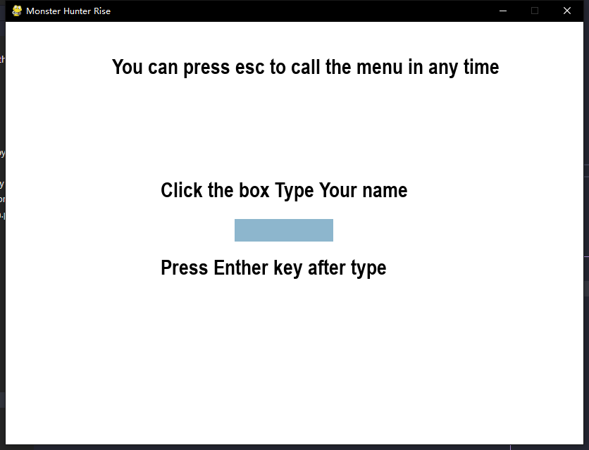

Then choose the weapon you want

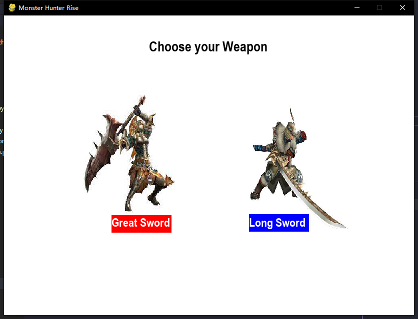

You can damage the monster by clicking the monster also monster will deduct your health points

Your damage is depends on your attack points(ap)

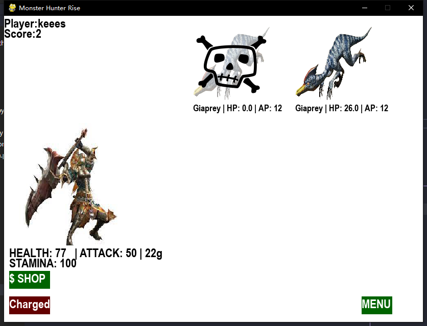

You can click the skills on the bottom left corner to damage the monsters which will not cause any HP deduction

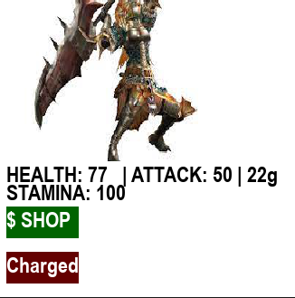 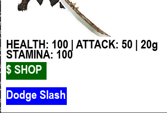

When the monster dies, it will give you gold

You can use gold buy items by clicking Shop button and clicking item

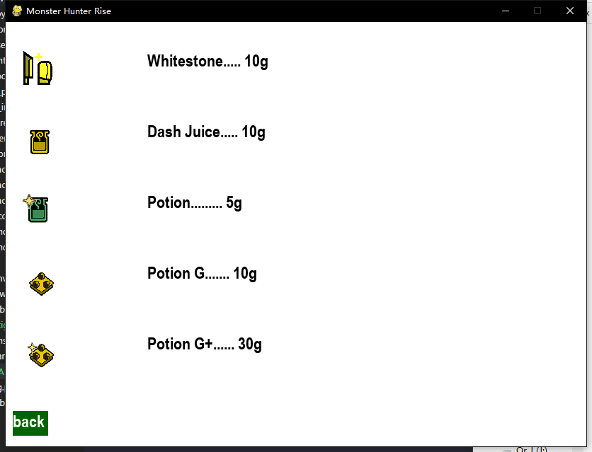

Each 5 round will have a strong monster appear

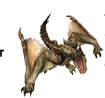 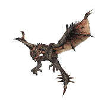 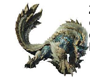

You can enter ESC and click the tags to see more details

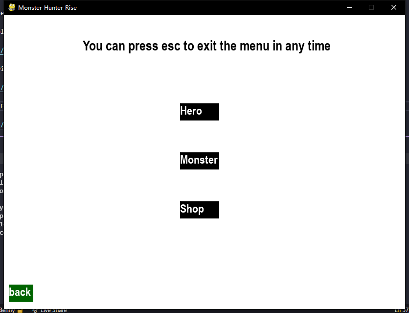

Click the cross on the upper right corner to close the game!

## Score
You can access http://127.0.0.1:5000/ to know your score if you run the web.py

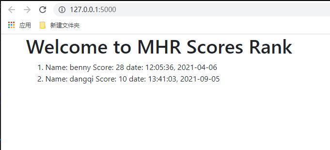
